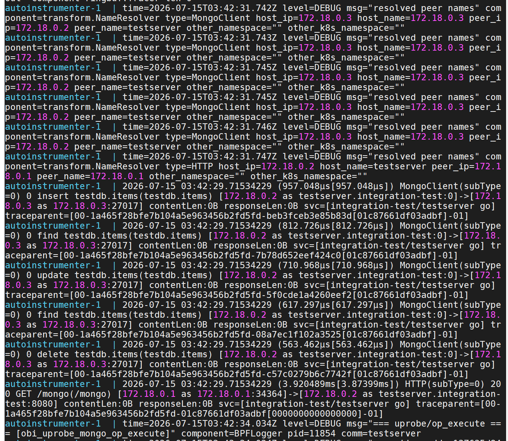

# su26-ai301-contribution

# Contribution 1: Try to determine the hostname for MongoDB connections

**Contribution Number:** 1

**Student:** Yuyan Ke 

**Issue:** https://github.com/open-telemetry/opentelemetry-ebpf-instrumentation/issues/1192

**Status:** Implementation Complete — Testing in Progress

---

## Why I Chose This Issue

[1-2 paragraphs explaining why this issue interests you, how it matches your skills/learning goals, what you hope to learn]

This issue deals with mongo database configuration, and given my background with system and recently starting to work more with Mongo DB at work, this issue offers an opportunity to dig into the Mongo configuration. Since this will be my very first open-source contribution, I'm hoping to learn and experience the end-to-end process first as a stepping stone. 

---

## Understanding the Issue

### Problem Description

[In your own words, what's broken or missing?]

Mongo connection detail does not include hostname, so this issue is to determine the Mongo database hostname from the connection string. Hostname is more descriptive and human-friendly compared to IP addresses or random strings. 

### Expected Behavior

[What should happen?]

Upon successfully completion of this issue, Mongo DB hostname can be determined and logged based on connection string.

### Current Behavior

[What actually happens?]

Only Mongo conenction string is available, no hostname.

### Affected Components

[Which parts of the codebase are involved?]

Code change in `go_mongo.c` , references available in `go_sql.c`, specifically the `read_mysql_hostname_from_mysqlconn()`.

---

## Reproduction Process

### Environment Setup

[Notes on setting up your local development environment - challenges you faced, how you solved them]
Setting up the local development environment on Windows 10 required a few extra steps since eBPF is a Linux kernel technology and cannot run natively on Windows.

**Challenge 1: eBPF does not run on Windows**

eBPF is a Linux kernel feature. Attempting to run the instrumentation directly on Windows 10 is not possible.

*Solution:* Install WSL2 (Windows Subsystem for Linux 2), which provides a real Linux kernel on Windows. WSL2 is available on Windows 10 build 19041+.

```powershell
# Run in PowerShell as Administrator
wsl --install -d Ubuntu
```

After rebooting, verify the kernel version inside WSL2:
```bash
uname -r
# Should show 5.15.x or higher
```

**Challenge 2: `docker compose -f` flag not recognized**

Running the test stack with `docker compose -f docker-compose-go-mongo.yml up --build` failed because the machine only had the older standalone `docker-compose` binary (v1.25.9), not the Docker Compose v2 plugin. The v2 plugin is what provides the `docker compose` (with a space) subcommand.

*Solution:* This pointed toward using the v1 binary (`docker-compose`) instead, but that surfaced a new problem (see Challenge 3).

**Challenge 3: `docker-compose` v1 rejects the compose file**

Switching to `docker-compose -f docker-compose-go-mongo.yml up --build` failed with:

```
ERROR: The Compose file './docker-compose-go-mongo.yml' is invalid because:
Unsupported config option for services: 'autoinstrumenter'
```

The compose file uses two features that v1 does not support:
- No `version:` field (modern Compose Spec format) — v1 misinterprets the file structure entirely
- `pid: "service:testserver"` — sharing a PID namespace with another service is v2-only

*Solution:* Docker Compose v2 is required. There is no workaround using v1.

**[WIP] Challenge 4: `docker-compose-plugin` not available via apt on Ubuntu 20.04**

Attempting to install the v2 plugin through apt failed:

```
E: Unable to locate package docker-compose-plugin
```

This is because Ubuntu 20.04 (Focal) does not include `docker-compose-plugin` in its default package repositories.

*Solution:* Install the Docker Compose v2 binary directly from GitHub releases into the Docker CLI plugins directory:

```bash
DOCKER_CONFIG=${DOCKER_CONFIG:-$HOME/.docker}
mkdir -p $DOCKER_CONFIG/cli-plugins
curl -SL https://github.com/docker/compose/releases/download/v2.27.0/docker-compose-linux-x86_64 \
  -o $DOCKER_CONFIG/cli-plugins/docker-compose
chmod +x $DOCKER_CONFIG/cli-plugins/docker-compose
```

### Steps to Reproduce [Expected]

**Step 1 — Start the test stack**

From the repo root in a WSL2 terminal:
```bash
cd internal/test/oats/mongo
docker compose -f docker-compose-go-mongo.yml up --build
```

This starts three services: a MongoDB instance (port 27017), a Go test HTTP server (port 8080), and the OBI eBPF auto-instrumenter attached to the test server's process.

**Step 2 — Trigger MongoDB operations**

In a second WSL2 terminal:
```bash
curl http://localhost:8080/mongo
```

This runs InsertOne → FindOne → UpdateOne → FindOne → DeleteOne against the `testdb.items` collection.

**Step 3 — Observe the span output**

```bash
docker compose -f docker-compose-go-mongo.yml logs autoinstrumenter
```


### Reproduction Evidence

- **Branch:** [mongo-connection](https://github.com/keyuyan1145/opentelemetry-ebpf-instrumentation/tree/mongo-connection)
- **Screenshots/logs:** 

**What the logs show:**

After running `curl http://localhost:8080/mongo`, the autoinstrumenter printed a span for each MongoDB operation. The actual log output:

```
2026-07-15 03:42:29.71534229 (957.048µs) MongoClient(subType=0) 0 insert testdb.items(testdb.items) [172.18.0.2 as testserver.integration-test:0]->[172.18.0.3 as 172.18.0.3:27017]
2026-07-15 03:42:29.71534229 (812.726µs) MongoClient(subType=0) 0 find   testdb.items(testdb.items) [172.18.0.2 as testserver.integration-test:0]->[172.18.0.3 as 172.18.0.3:27017]
2026-07-15 03:42:29.71534229 (710.968µs) MongoClient(subType=0) 0 update testdb.items(testdb.items) [172.18.0.2 as testserver.integration-test:0]->[172.18.0.3 as 172.18.0.3:27017]
2026-07-15 03:42:29.71534229 (617.297µs) MongoClient(subType=0) 0 find   testdb.items(testdb.items) [172.18.0.2 as testserver.integration-test:0]->[172.18.0.3 as 172.18.0.3:27017]
2026-07-15 03:42:29.71534229 (563.462µs) MongoClient(subType=0) 0 delete testdb.items(testdb.items) [172.18.0.2 as testserver.integration-test:0]->[172.18.0.3 as 172.18.0.3:27017]
```

The format `[source]->[destination]` shows where the request came from and where it went. The destination for every MongoDB span is:
```
172.18.0.3 as 172.18.0.3:27017
```

This means the MongoDB server is identified only by its **IP address** (`172.18.0.3`). The test server connects using `mongodb://mongo:27017` — the hostname is `"mongo"` — but the eBPF probe never reads that hostname from the connection string, so only the raw IP is available.

The debug logs from the `NameResolver` component confirm this:
```
type=MongoClient host_ip=172.18.0.3 host_name=172.18.0.3 peer_ip=172.18.0.2 peer_name=testserver
```

The MongoDB server (`host_ip=172.18.0.3`) has `host_name=172.18.0.3` — the name and IP are the same, meaning no hostname was resolved from the connection string.

Compare this to the HTTP span in the same output:
```
HTTP(subType=0) 200 GET /mongo(/mongo) [172.18.0.1 as 172.18.0.1:34364]->[172.18.0.2 as testserver.integration-test:8080]
```

The HTTP destination correctly shows `testserver.integration-test` as the name because the HTTP instrumentation resolves it. MongoDB should similarly show `mongo` — but it doesn't because `go_mongo.c` never extracts the hostname from the connection string.


---

## Solution Approach

### Analysis

#### Actual vs Expected

After running `curl http://localhost:8080/mongo`, the autoinstrumenter emits one span per MongoDB operation. The issue is visible in the destination address shown in each span line.

**Actual output (current behavior):**
```
MongoClient insert testdb.items  [172.18.0.2 as testserver:0]->[172.18.0.3 as 172.18.0.3:27017]
```

The destination is `172.18.0.3 as 172.18.0.3:27017` — the server is identified only by its raw IP address. The NameResolver debug log confirms no hostname was resolved:
```
type=MongoClient host_ip=172.18.0.3 host_name=172.18.0.3 peer_ip=172.18.0.2 peer_name=testserver
```
`host_name` equals `host_ip` — no hostname was ever captured, so the IP is used as a fallback.

**Expected output (after fix):**
```
MongoClient insert testdb.items  [172.18.0.2 as testserver:0]->[172.18.0.3 as mongo:27017]
```

The destination should show `mongo:27017` — the hostname from the connection string `mongodb://mongo:27017`. In OTel span attributes this maps to:

| Attribute | Actual | Expected |
|---|---|---|
| `server.address` | `172.18.0.3` | `mongo` |
| `server.port` | `27017` | `27017` (already correct) |

The Go test server connects using `mongodb://mongo:27017`, so the driver knows the hostname is `"mongo"` — it is stored internally in the driver's topology struct. The problem is that the eBPF probe never reads it from there, so it never reaches the span.

---

This section traces the full path a MongoDB operation travels through the system — from the Go application making a database call all the way to the span that gets emitted by the eBPF instrumentation. Understanding this path makes it clear exactly where the hostname is lost and where the fix needs to go.

---

#### Actor 1: The Go Application
**File:** `internal/test/integration/components/gomongo/main.go`

The test server connects to MongoDB using the connection string `mongodb://mongo:27017`. The hostname `"mongo"` is embedded in that URI. When a request comes in, it calls the standard MongoDB Go driver methods: `InsertOne`, `FindOne`, `UpdateOne`, `DeleteOne`. The application itself never explicitly extracts the hostname — it just passes the URI to the driver and trusts it handles routing.

---

#### Actor 2: The MongoDB Go Driver (library code)
**Package:** `go.mongodb.org/mongo-driver/v2`

The driver parses the connection URI and stores the hostname internally in a `topology.Topology` struct. When a collection operation is called (e.g., `InsertOne`), the driver routes through two internal types:
- `Collection` — holds the collection name and a reference back to the client/database
- `driver.Operation` — the low-level execution unit, which holds:
  - `Database` (string) — the database name
  - `Deployment` (interface) — typically a `*topology.Topology` that knows which servers exist, including their hostnames

`Operation.Execute(ctx)` is the method that does the actual network send. This is the function the eBPF probes hook into.

---

#### Actor 3: eBPF Probes in the Kernel
**File:** `bpf/gotracer/go_mongo.c`

Three uprobes intercept driver calls at runtime by hooking into specific memory addresses in the running process:

**Probe 1 — `obi_uprobe_mongo_coll_op()`**
Fires when any collection-level operation starts (insert, find, update, delete, etc.). Reads the `Collection.name` field from the struct in memory using `read_go_str()`, records the operation type (e.g., `"insert"`), and stores the partial event in an eBPF hash map (`ongoing_mongo_requests`) keyed by goroutine ID.

**Probe 2 — `obi_uprobe_mongo_op_execute()`**
Fires when `Operation.Execute()` is called. Reads `Operation.Database` from the struct and adds it to the map entry for the current goroutine. **This is the right place to also read the hostname** — the `Operation.Deployment` field (accessible from the same `Operation` struct pointer) leads to the topology, which holds the server address. Currently, this probe stops after reading the database name and never follows the `Deployment` pointer to extract the hostname.

**Probe 3 — `obi_uprobe_mongo_op_execute_ret()`**
Fires when `Operation.Execute()` returns. Reads the error status, copies the complete struct from the eBPF map to the **ring buffer** (a shared kernel-to-user-space data channel), and removes the map entry. At this point the event is sent to user space.

---

#### Actor 4: The Event Struct — the missing field
**File:** `bpf/common/common.h`

The data that crosses from kernel space to user space is a C struct called `mongo_go_client_req_t`:

```c
typedef struct mongo_go_client_req {
    u8 type;
    u8 err;
    u8 _pad[6];
    u64 start_monotime_ns;
    u64 end_monotime_ns;
    pid_info pid;
    unsigned char op[32];    // operation name, e.g. "insert"
    unsigned char db[32];    // database name, e.g. "testdb"
    unsigned char coll[32];  // collection name, e.g. "items"
    connection_info_t conn;  // IP addresses and ports (numeric only)
    tp_info_t tp;            // trace context (trace ID, span ID)
} mongo_go_client_req_t;
```

There is no `hostname` field. Even if the kernel probe read the hostname successfully, there is nowhere to put it — the struct cannot carry it to user space. This is why adding a `hostname` field here is step one of the fix.

---

#### Actor 5: User-Space Transform
**File:** `pkg/ebpf/common/mongo_detect_transform.go` — function `ReadGoMongoRequestIntoSpan()`

This function reads the raw `mongo_go_client_req_t` bytes off the ring buffer and converts them into a `request.Span` (the internal OTel span representation). The relevant lines:

```go
if event.Conn.S_port != 0 || event.Conn.D_port != 0 {
    peer, hostname = (*BPFConnInfo)(unsafe.Pointer(&event.Conn)).reqHostInfo()
    hostPort = int(event.Conn.D_port)
}
```

`reqHostInfo()` derives a "hostname" from the IP-level connection info in `event.Conn`. Since `Conn` only contains raw IP addresses (captured from the network packet), `hostname` ends up as the IP string `"172.18.0.3"` — not the DNS name `"mongo"`. The span is created with `Host: hostname`, which becomes `server.address` in the final OTel span.

Because the `mongo_go_client_req_t` struct has no hostname field, this function has no way to set `server.address` to the actual hostname — even though the driver knew it all along.

---

#### Root Cause Summary

The diagram below traces a single `curl` call end-to-end and shows exactly where the hostname disappears:

```
USER
  │
  │  curl http://localhost:8080/mongo
  ▼
┌─────────────────────────────────────────────────────────────┐
│  Go Test Server  (gomongo/main.go, port 8080)               │
│                                                             │
│  On startup:  client, _ = mongo.Connect(                    │
│                 "mongodb://mongo:27017")   ← hostname here  │
│                                                             │
│  On /mongo:   coll.InsertOne(...)                           │
│               coll.FindOne(...)                             │
│               coll.UpdateOne(...)    ← driver calls         │
│               coll.FindOne(...)                             │
│               coll.DeleteOne(...)                           │
└──────────────────┬──────────────────────────────────────────┘
                   │  each driver call eventually reaches
                   ▼
┌─────────────────────────────────────────────────────────────┐
│  MongoDB Go Driver  (go.mongodb.org/mongo-driver/v2)        │
│                                                             │
│  Connection URI parsed at startup:                          │
│    "mongodb://mongo:27017"                                  │
│     → hostname "mongo" stored in topology.Topology          │
│                                                             │
│  Per operation:                                             │
│    Collection.InsertOne()                                   │
│      → driver.Operation{                                    │
│            Database:   "testdb",                            │
│            Deployment: *topology.Topology  ← "mongo" here  │
│          }.Execute(ctx)    ← eBPF hooks here                │
└──────────────────┬──────────────────────────────────────────┘
                   │  Operation.Execute() called
                   ▼
┌─────────────────────────────────────────────────────────────┐
│  eBPF Probes in kernel  (bpf/gotracer/go_mongo.c)           │
│                                                             │
│  Probe 1 — obi_uprobe_mongo_coll_op()                       │
│    fires on: Collection.Insert / Find / Update / Delete     │
│    reads:    Collection.name  → req.coll = "items"          │
│    reads:    op type          → req.op   = "insert"         │
│    stores:   partial req in ongoing_mongo_requests map      │
│                                                             │
│  Probe 2 — obi_uprobe_mongo_op_execute()                    │
│    fires on: Operation.Execute() entry                      │
│    reads:    Operation.Database → req.db = "testdb"         │
│    MISSING:  Operation.Deployment → topology → "mongo"  ✗   │
│    stores:   updated req in map                             │
│                                                             │
│  Probe 3 — obi_uprobe_mongo_op_execute_ret()                │
│    fires on: Operation.Execute() return                     │
│    reads:    error status                                   │
│    submits:  mongo_go_client_req_t to ring buffer           │
└──────────────────┬──────────────────────────────────────────┘
                   │  ring buffer event (kernel → user space)
                   ▼
┌─────────────────────────────────────────────────────────────┐
│  mongo_go_client_req_t  (bpf/common/common.h)               │
│                                                             │
│    op[32]   = "insert"                                      │
│    db[32]   = "testdb"                                      │
│    coll[32] = "items"                                       │
│    conn     = { src_ip: 172.18.0.2, dst_ip: 172.18.0.3,    │
│                 dst_port: 27017 }   ← IPs only, no name     │
│    hostname = ??? field does not exist  ✗                   │
└──────────────────┬──────────────────────────────────────────┘
                   │  ReadGoMongoRequestIntoSpan()
                   ▼
┌─────────────────────────────────────────────────────────────┐
│  User-Space Transform  (mongo_detect_transform.go)          │
│                                                             │
│    hostname = reqHostInfo(event.Conn)                       │
│             = "172.18.0.3"   ← IP only, no DNS name         │
│                                                             │
│    Span.Host     = "172.18.0.3"                             │
│    Span.HostPort = 27017                                    │
└──────────────────┬──────────────────────────────────────────┘
                   │
                   ▼
  OTel Span output:
    MongoClient insert testdb.items
      server.port    = 27017       ✓
      server.address = 172.18.0.3  ✗  (should be "mongo")
```

**Why the hostname is lost:** The driver stored `"mongo"` inside its `topology.Topology` struct the whole time, but Probe 2 never follows the `Operation.Deployment` pointer to reach it. With no hostname in the event struct and no hostname field to carry it across the kernel/user boundary, the transform falls back to the raw destination IP.

The fix requires three things working together:
1. **`go_mongo.c`** — Probe 2 must dereference `Operation.Deployment → topology.Topology → server address` and store it in `req.hostname`
2. **`common.h`** — `mongo_go_client_req_t` must gain a `hostname` field to carry the string across the ring buffer
3. **`mongo_detect_transform.go`** — `ReadGoMongoRequestIntoSpan` must read `event.Hostname` and use it as `Host` in the span instead of falling back to the IP

The SQL instrumentation in `bpf/gotracer/go_sql.c` already does this exact pattern for MySQL and PostgreSQL — `read_mysql_hostname_from_mysqlconn()` and `read_pgx_hostname_from_conn()` serve as direct references for the MongoDB equivalent.

### Proposed Solution

[High-level description of your fix approach]

### Implementation Plan

Using UMPIRE framework (adapted):

**Understand:** 
MongoDB spans produced by the eBPF instrumentation are missing the `server.address` attribute. The connection string (e.g., `mongodb://mongo:27017`) contains the hostname, but `go_mongo.c` never reads or stores it — the `mongo_go_client_req_t` struct has no hostname field, so the user-space transform has nothing to emit as `server.address`.

**Match:**
`go_sql.c` solves the identical problem for MySQL and PostgreSQL. It reads a hostname string by dereferencing a pointer chain from the driver connection struct into an internal config field (`mysqlConn.cfg.Addr`, `pgx.Conn.config.Host`). The offset for that field is registered in `go_offsets.h`, injected at eBPF load time, and the string is extracted with `read_go_str()`. The MongoDB equivalent pointer chain starts from the `Operation` struct (already available in `obi_uprobe_mongo_op_execute`) via its `Deployment` interface field, which holds a `*topology.Topology` whose `servers` map entry contains a `description.Server` with an `Addr` string field.

**Plan:**
1. **[bpf/common/common.h]** — Add `unsigned char hostname[k_mongo_hostname_max_len]` field to `mongo_go_client_req_t`. Define a dedicated `k_mongo_hostname_max_len = 96` constant rather than reusing `k_sql_hostname_max_len` — MongoDB hostnames are shorter than full SQL payloads (96 bytes is sufficient for `"hostname:27017"`) and keeping it separate avoids coupling two unrelated protocols.
2. **[bpf/gotracer/go_offsets.h]** — Add a new offset entry (e.g., `_mongo_server_addr_pos`) for the address string field inside the MongoDB driver's topology server struct.
3. **[bpf/gotracer/go_mongo.c]** — In `obi_uprobe_mongo_op_execute`, after reading `req->db`, dereference `Operation.Deployment` → `topology.Topology` → server address string and store it in `req->hostname` using `read_go_str()`.
4. **[pkg/ebpf/common/mongo_detect_transform.go]** — Read `req.hostname` from the eBPF event and set it as the `server.address` span attribute (mirror how the SQL transform handles `trace.hostname`).
5. **[internal/test/oats/mongo/yaml/oats_go_mongo.yaml]** — Add `server.address: 'mongo'` to the expected attributes on the MongoDB span assertion.

**Implement:** [Link to your branch/commits as you work]

**Review:**
- [ ] New struct field does not break struct layout alignment (padding may be needed)
- [ ] Offset key follows the existing `_mongo_*` naming convention in `go_offsets.h`
- [ ] `read_go_str` call is guarded with a `bpf_dbg_printk` on failure, matching the style of other reads in `go_mongo.c`
- [ ] Transform sets `server.address` only when the hostname field is non-empty (avoid emitting blank attribute)
- [ ] Contribution follows CONTRIBUTING.md — DCO sign-off on commits

**Evaluate:**
Run the OATS test locally after the fix:
​```bash
cd internal/test/oats/mongo
docker compose -f docker-compose-go-mongo.yml up --build
curl http://localhost:8080/mongo
docker compose -f docker-compose-go-mongo.yml logs autoinstrumenter
​```
The span for `insert testdb.items` should now include `server.address: mongo`. The OATS assertion in `oats_go_mongo.yaml` will also catch regressions automatically in CI.

## Testing Strategy

### Unit Tests

- [ ] Test case 1: [Description]
- [ ] Test case 2: [Description]
- [ ] Test case 3: [Description]

### Integration Tests

- [ ] Integration scenario 1
- [ ] Integration scenario 2

### Manual Testing

[What you tested manually and results]

---

## Weekly Progress

### Week 3 Progress (Jun 17–24)

**What I worked on:**
- Continued environment setup from the previous session, picking up at Challenge 4 (Docker Compose v2 not available via apt)
- Successfully installed Docker Compose v2 manually via a `curl` download directly from GitHub releases (workaround for Ubuntu 20.04 Focal where `docker-compose-plugin` is not in the default apt repository)
- Resolved Docker daemon not starting — WSL2 on Windows 10 does not run systemd by default, so `sudo service docker start` failed with "unrecognized service". Fixed by installing Docker Desktop for Windows with WSL2 integration enabled
- Fixed Docker credential store conflict: Docker Desktop had set `"credsStore": "desktop.exe"` in `~/.docker/config.json`, but `docker-credential-desktop.exe` is not accessible from inside WSL2. Fixed by resetting the config to `{}`
- Fixed CGo build failure in the gomongo test server Dockerfile — Docker Desktop's seccomp profile blocks `posix_spawn`, which Go's CGo uses to invoke GCC. Added `ENV CGO_ENABLED=0` to `gomongo/Dockerfile` since the test server does not need CGo
- Investigated autoinstrumenter build failure where even basic shell commands (`/bin/sh`, `awk`, `git`) were blocked with "Operation not permitted". Replaced `RUN make compile-for-coverage` with a direct `go build` command in `obi/Dockerfile` to bypass the `make → sh` chain
- Discovered the root cause of the autoinstrumenter build failure: the `*_bpfel.go` files generated by `bpf2go` (from compiling eBPF C code) are listed in `.gitignore` and are not committed. They must be produced by `make generate` on a Linux host with `clang` and eBPF tooling installed before the Docker build runs — this step is done in CI but is not practical on a Windows development machine
- Created `docker-compose-go-mongo-local.yml` as a local workaround: replaces the from-source autoinstrumenter build with the published `otel/ebpf-instrument:latest` image, allowing reproduction without needing the full eBPF toolchain

**Challenges faced:**
- Docker daemon would not start in WSL2 because Windows 10 WSL2 does not enable systemd by default — `service docker start` was unrecognized. Spent time trying `sudo dockerd` before switching to Docker Desktop as the daemon manager
- Docker credential helper `desktop.exe` was set automatically by Docker Desktop installation but is a Windows binary not reachable from Linux WSL2, causing all `docker pull`/`docker compose` image operations to fail with a credential error
- Docker Desktop's default seccomp profile blocks `posix_spawn` inside build containers, which breaks CGo-based Go builds and any process that `fork/exec`s subprocesses (including `make` invoking `/bin/sh`)
- The autoinstrumenter cannot be built from source on a local Windows/WSL2 machine because the eBPF-generated Go bindings (`*_bpfel.go`) require `clang` and `bpf2go` to produce and are excluded from source control

**Files modified:**
- `internal/test/integration/components/gomongo/Dockerfile` — added `ENV CGO_ENABLED=0` before the build step
- `internal/test/integration/components/obi/Dockerfile` — replaced `RUN make compile-for-coverage` with direct `RUN CGO_ENABLED=0 GOOS=linux go build -cover -a -o bin/obi cmd/obi/main.go`
- `internal/test/oats/mongo/docker-compose-go-mongo-local.yml` — created new local compose file using the published `otel/ebpf-instrument:latest` image for the autoinstrumenter

**Branch:** [mongo-connection](https://github.com/keyuyan1145/opentelemetry-ebpf-instrumentation/tree/mongo-connection)

**Key commits:** [Link when committed]

---

### Week 4 Progress (Jun 24 – Jul 1)

**What I worked on:**
- Switched from WSL2 to a VirtualBox Ubuntu VM due to ongoing compatibility issues — WSL2's older Microsoft kernel (5.10.x) lacked BTF support (`CONFIG_DEBUG_INFO_BTF`) required for eBPF, and Docker Desktop's seccomp profile was blocking basic process execution inside containers
- Set up a fresh Ubuntu 20.04.1 VM on VirtualBox and confirmed the VM is running
- Diagnosed remaining blockers on the VM before reproduction can proceed:
  - Kernel 5.11.0-34-generic does not expose `/sys/kernel/btf/vmlinux` — BTF is missing, which will cause the autoinstrumenter to fail at startup with `kernel does not support BTF`
  - Docker Compose v2 is not installed (only Docker 20.10.7 from Ubuntu's default repo)
  - Need to reset VM credentials before applying system updates

**Challenges faced:**
- The WSL2 approach was abandoned after the autoinstrumenter crashed immediately with `kernel does not support BTF (CONFIG_DEBUG_INFO_BTF): no vmlinux BTF found` — the Microsoft-provided WSL2 kernel does not have BTF compiled in
- MongoDB 8.3.1 also crashed inside the WSL2 Docker environment with `Operation not permitted` (seccomp blocking kernel calls), further confirming that WSL2 + Docker Desktop is not a viable environment for this project
- VirtualBox Ubuntu VM has the same BTF gap — Ubuntu 20.04's default 5.11 HWE kernel does not enable `CONFIG_DEBUG_INFO_BTF`; needs upgrade to the 5.15 HWE kernel
- Forgot VM sudo credentials — need to recover via GRUB recovery mode before running system updates

**Next steps to complete reproduction:**
1. Reset VM sudo password via VirtualBox GRUB recovery mode
2. Upgrade the kernel to 5.15 HWE to enable BTF support
3. Install Docker Compose v2
4. Run the test stack using the steps below

---

### Local Reproduction Steps (Ubuntu VM)

Follow these steps in order after the VM is fully configured.

**Step 1 — Upgrade kernel for BTF support (required for eBPF)**
```bash
sudo apt update
sudo apt install --install-recommends linux-generic-hwe-20.04
sudo reboot
```

After reboot, verify:
```bash
uname -r
# Should show 5.15.x

ls /sys/kernel/btf/vmlinux && echo "BTF supported"
```

**Step 2 — Install Docker Compose v2**
```bash
DOCKER_CONFIG=${DOCKER_CONFIG:-$HOME/.docker}
mkdir -p $DOCKER_CONFIG/cli-plugins
curl -SL https://github.com/docker/compose/releases/download/v2.27.0/docker-compose-linux-x86_64 \
  -o $DOCKER_CONFIG/cli-plugins/docker-compose
chmod +x $DOCKER_CONFIG/cli-plugins/docker-compose
docker compose version
```

**Step 3 — Clone the repo on the working branch**
```bash
git clone https://github.com/keyuyan1145/opentelemetry-ebpf-instrumentation.git
cd opentelemetry-ebpf-instrumentation
git checkout mongo-connection
```

**Step 4 — Run the test stack**

The `docker-compose-go-mongo-local.yml` file uses the published `otel/ebpf-instrument:latest` image for the autoinstrumenter instead of building from source. This is necessary because the eBPF-generated Go bindings (`*_bpfel.go`) are excluded from source control and require `clang` + `bpf2go` to generate — tools not available in a basic dev environment.
```bash
cd internal/test/oats/mongo
docker compose -f docker-compose-go-mongo-local.yml up --build
```

**Step 5 — Trigger MongoDB operations (open a second terminal)**
```bash
curl http://localhost:8080/mongo
```

This runs InsertOne → FindOne → UpdateOne → FindOne → DeleteOne against the `testdb.items` collection.

**Step 6 — Observe the span output**
```bash
docker compose -f docker-compose-go-mongo-local.yml logs autoinstrumenter
```

Look for span lines containing `insert`, `find`, `update`, `delete`. You should see `server.port: 27017` present but `server.address` absent — this confirms the bug this contribution is fixing.

---

### Week 5 Progress (Jul 1–8)

**What I worked on:**
- Attempted to recover the Ubuntu VM sudo credentials via GRUB recovery mode — the GRUB menu opened but displayed an error screen instead of a usable menu
- Tried the GRUB root shell approach (recovery mode) but it prompted for a root password, which was also unknown
- Attempted the alternative GRUB method of editing boot parameters directly (`init=/bin/bash`) but the GRUB screen error prevented this
- Decided to create a fresh Ubuntu VM rather than continue debugging the credential issue
- Attempted to install Ubuntu 26.04 — the VM crashed on boot with a kernel panic: `Kernel panic - not syncing: Attempted to kill the idle task!`
- Identified two root causes of the kernel panic:
  - **Hyper-V conflict**: Docker Desktop enables Hyper-V on Windows 10, which conflicts with VirtualBox's hardware virtualization (VT-x/AMD-V) — both cannot run simultaneously
  - **Ubuntu 26.04 incompatibility**: The downloaded Ubuntu 26.04 ISO is too new for the current VirtualBox version, which has not yet been updated to support it fully
- Identified correct setup path going forward: use Ubuntu 22.04 LTS with VirtualBox 7.x after disabling Hyper-V

**Challenges faced:**
- GRUB recovery mode was inaccessible due to a screen error, and the root shell required an unknown root password — no straightforward way to reset credentials on the existing VM
- Ubuntu 26.04 caused a kernel panic in VirtualBox — newer Ubuntu versions require a matching VirtualBox version to boot correctly
- Hyper-V (used by Docker Desktop on Windows 10) and VirtualBox cannot run at the same time — this is a fundamental Windows 10 limitation that requires choosing one or the other per boot

**Next steps to complete VM setup:**
1. Run in PowerShell (admin) and reboot Windows: `bcdedit /set hypervisorlaunchtype off`
2. Update VirtualBox to version 7.x from `https://www.virtualbox.org/wiki/Downloads`
3. Download Ubuntu 22.04 LTS ISO from `https://ubuntu.com/download/desktop`
4. Delete the broken VM and create a new one using Ubuntu 22.04 LTS
5. After successful Ubuntu install, proceed with the reproduction steps documented above

---

### Week 7 Progress (Jul 15–21)

**What I worked on:**
- **Step 1** (`bpf/common/common.h`): Added `k_mongo_hostname_max_len = 96` constant and `unsigned char hostname[k_mongo_hostname_max_len]` field to `mongo_go_client_req_t` so the hostname can be carried across the kernel/user-space boundary
- **Step 2** (`bpf/gotracer/go_offsets.h`, `pkg/internal/goexec/structmembers.go`): Registered 4 new offset keys (`_mongo_deployment_pos`, `_mongo_topo_cfg_pos`, `_mongo_cfg_seedlist_pos`, `_mongo_server_addr_pos`) and 6 struct field registrations (v1 + v2 for `topology.Topology`, `topology.Config`, `topology.Server`) so the offset injection system can locate the hostname pointer chain at load time
- **Step 3** (`bpf/gotracer/go_mongo.c`): Added `read_mongo_hostname_from_operation()` helper that walks `Operation.Deployment → *topology.Topology → cfg (*Config) → SeedList[0]` and writes the result to `req->hostname`; called non-fatally from `obi_uprobe_mongo_op_execute`
- **Step 4** (`pkg/ebpf/common/mongo_detect_transform.go`): Updated `ReadGoMongoRequestIntoSpan()` to read `event.Hostname`, strip the port suffix, and set `HostName` on the returned span so it maps to `server.address`
- **Step 5** (`internal/test/oats/mongo/yaml/oats_go_mongo.yaml`): Added `server.address: mongo` assertion to the insert span test case

**Branch:** [mongo-connection](https://github.com/keyuyan1145/opentelemetry-ebpf-instrumentation/tree/mongo-connection)

---

## Implementation Notes

This section documents the exact changes made in each implementation step and why each piece was necessary.

---

### Step 1 — Add hostname field to the event struct

**File:** `bpf/common/common.h`

A new constant was added to the existing constants enum, and a new field was added to `mongo_go_client_req_t`. This struct is the data packet that travels from kernel space (eBPF) to user space — without a field here, any hostname the eBPF probe reads would have nowhere to go.

```c
// Added constant (after k_mongo_max_len):
k_mongo_max_len = 256,
k_mongo_hostname_max_len = 96,

// Updated struct:
typedef struct mongo_go_client_req {
    u8 type;
    u8 err;
    u8 _pad[6];
    u64 start_monotime_ns;
    u64 end_monotime_ns;
    pid_info pid;
    unsigned char op[32];
    unsigned char db[32];
    unsigned char coll[32];
    unsigned char hostname[k_mongo_hostname_max_len];  // NEW
    connection_info_t conn;
    tp_info_t tp;
} mongo_go_client_req_t;
```

`k_mongo_hostname_max_len = 96` is sized for typical MongoDB hostnames with port (e.g., `"my-mongo-server.internal:27017"` fits well within 96 bytes). Using a dedicated constant instead of reusing `k_sql_hostname_max_len` keeps the two protocols independent — a future change to SQL sizing won't silently affect MongoDB.

---

### Step 2 — Register offset keys for the pointer chain

**File:** `bpf/gotracer/go_offsets.h` and `pkg/internal/goexec/structmembers.go`

The eBPF program cannot hard-code field offsets because Go struct layouts differ between compiler versions and driver releases. Instead, the project's offset injection system discovers the byte offset of each field at load time (via DWARF debug info or `offsets.json`) and stores them in a BPF map. eBPF code calls `go_offset_of(ot, key)` to retrieve the offset at runtime.

Four new enum keys were added to the C header (in the `// go mongodb` block, preserving exact ordering with the Go iota constants):

```c
// go mongodb
_mongo_conn_name_pos,
_mongo_op_name_pos,
_mongo_db_name_pos,
_mongo_op_name_new,
_mongo_server_addr_pos,    // topology.Server.address
_mongo_deployment_pos,     // Operation.Deployment interface
_mongo_topo_cfg_pos,       // topology.Topology.cfg
_mongo_cfg_seedlist_pos,   // topology.Config.SeedList
```

Matching Go constants were added to `structmembers.go` (the comment on that file explicitly warns the order must match `go_offsets.h`):

```go
MongoServerAddrPos      // topology.Server.address
MongoDeploymentPos      // Operation.Deployment
MongoTopoCfgPos         // topology.Topology.cfg
MongoCfgSeedlistPos     // Config.SeedList
```

`Deployment` was also added to the existing `driver.Operation` struct registrations (both v1 and v2), and six new struct registrations were added for `topology.Server`, `topology.Topology`, and `topology.Config`/`topology.config` — the last two differ between v1 (lowercase, unexported) and v2 (uppercase, exported):

```go
"go.mongodb.org/mongo-driver/x/mongo/driver/topology.config": {
    lib: "go.mongodb.org/mongo-driver",
    fields: map[string]GoOffset{"seedList": MongoCfgSeedlistPos},  // v1: unexported
},
"go.mongodb.org/mongo-driver/v2/x/mongo/driver/topology.Config": {
    lib: "go.mongodb.org/mongo-driver",
    fields: map[string]GoOffset{"SeedList": MongoCfgSeedlistPos},  // v2: exported
},
```

---

### Step 3 — Implement the hostname extraction helper in eBPF

**File:** `bpf/gotracer/go_mongo.c`

A new helper function `read_mongo_hostname_from_operation()` was added before `obi_uprobe_mongo_coll_op`. It follows the pointer chain `Operation.Deployment → *topology.Topology → cfg (*Config) → SeedList[0]` in four steps, each guarded with a debug print:

```c
static __always_inline bool
read_mongo_hostname_from_operation(void *op_ptr, off_table_t *ot, mongo_go_client_req_t *req) {
    bpf_dbg_printk("=== read_mongo_hostname_from_operation op_ptr=%llx ===", op_ptr);

    // Step 1: Deployment is a Go interface {itab (8b), data ptr (8b)}.
    //         +8 skips the itab to get the concrete *topology.Topology pointer.
    u64 deployment_offset = go_offset_of(ot, (go_offset){.v = _mongo_deployment_pos});
    void *topology_ptr = NULL;
    bpf_probe_read(&topology_ptr, sizeof(topology_ptr),
                   (void *)((u64)op_ptr + deployment_offset + 8));

    // Step 2: topology.Topology.cfg is a *Config pointer.
    u64 cfg_offset = go_offset_of(ot, (go_offset){.v = _mongo_topo_cfg_pos});
    void *cfg_ptr = NULL;
    bpf_probe_read(&cfg_ptr, sizeof(cfg_ptr),
                   (void *)((u64)topology_ptr + cfg_offset));

    // Step 3: Config.SeedList is a []string slice {array_ptr, len, cap}.
    //         Reading 8 bytes gives the pointer to the underlying string array.
    u64 seedlist_offset = go_offset_of(ot, (go_offset){.v = _mongo_cfg_seedlist_pos});
    void *seedlist_array_ptr = NULL;
    bpf_probe_read(&seedlist_array_ptr, sizeof(seedlist_array_ptr),
                   (void *)((u64)cfg_ptr + seedlist_offset));

    // Step 4: SeedList[0] is the first Go string {data_ptr, len} at offset 0.
    read_go_str("server addr", seedlist_array_ptr, 0,
                req->hostname, sizeof(req->hostname));

    return true;
}
```

Two key differences from the SQL pattern (MySQL/pgx use a simple 2-hop pointer chase):
- **Interface dereference**: `Deployment` is a `driver.Deployment` interface. A Go interface is 16 bytes: 8 bytes of itab pointer followed by 8 bytes of data pointer. Adding `+8` to `deployment_offset` skips the itab and lands on the concrete `*topology.Topology` pointer.
- **Slice traversal**: `SeedList` is a `[]string`, not a plain string. A Go slice header is `{array_ptr, len, cap}`. Reading the first 8 bytes gives the pointer to the string array, and `read_go_str(array_ptr, 0, ...)` reads the first string at element offset 0.

The function is called non-fatally from `obi_uprobe_mongo_op_execute` — if extraction fails for any reason, the span is still emitted with an empty `server.address` rather than being dropped:

```c
// Non-fatal: the span is still emitted if hostname extraction fails.
if (read_mongo_hostname_from_operation(op_ptr, ot, req)) {
    bpf_dbg_printk("mongo hostname extracted: %s", req->hostname);
} else {
    bpf_dbg_printk("mongo hostname extraction failed, server.address will be empty");
}
```

---

### Step 4 — Read hostname in the user-space transform

**File:** `pkg/ebpf/common/mongo_detect_transform.go`

`ReadGoMongoRequestIntoSpan()` was updated to read `event.Hostname` from the eBPF event struct and set it as `HostName` on the span. Port stripping handles the fact that `SeedList[0]` is `"mongo:27017"` not just `"mongo"`:

```go
hostName := cstr(event.Hostname[:])
slog.Debug("mongo transform: raw hostname from eBPF event", "raw_hostname", hostName)
if idx := strings.LastIndex(hostName, ":"); idx != -1 {
    hostName = hostName[:idx]
    slog.Debug("mongo transform: stripped port from hostname", "hostname", hostName)
}
```

The span is returned with both `Host` (IP from `reqHostInfo()`) and `HostName` (DNS name from the driver) set:

```go
return &request.Span{
    ...
    Host:     host,      // IP address from connection packet
    HostName: hostName,  // DNS hostname from SeedList[0]
    HostPort: hostPort,
    ...
}
```

`slog.Debug` is used (not `fmt.Println`) because the codebase routes all structured logging through `log/slog` — these messages only appear when `OTEL_EBPF_LOG_LEVEL=DEBUG` is set, matching the same convention used by the SQL transform.

---

### Step 5 — Update the OATS test assertion

**File:** `internal/test/oats/mongo/yaml/oats_go_mongo.yaml`

A single line was added to the insert span assertion to verify `server.address` is populated with the hostname from the connection string:

```yaml
- traceql: '{ .db.operation.name = "insert" && .db.system.name = "mongodb" }'
  equals: insert testdb.items
  attributes:
    db.collection.name: testdb.items
    server.address: mongo    # NEW — hostname from "mongodb://mongo:27017"
    server.port: '27017'
```

`mongo` is the Docker Compose service name used in the test stack's connection string `mongodb://mongo:27017`. The OATS framework runs this test end-to-end: it starts the Docker Compose stack, sends a `curl /mongo` request, collects the emitted trace, and asserts each attribute matches.

To run this test on the VM:

```bash
# From the repo root
make oats-test-mongo
```

This calls `oats-prereq` (which runs `docker-generate` to build the autoinstrumenter from source) then runs Ginkgo against the YAML suite. To watch debug output from the eBPF probe while the test runs:

```bash
sudo cat /sys/kernel/debug/tracing/trace_pipe | grep mongo
```

---

## Pull Request

**PR Link:** [GitHub PR URL when submitted]

**PR Description:** [Draft or final PR description - much of the content above can be adapted]

**Maintainer Feedback:**
- [Date]: [Summary of feedback received]
- [Date]: [How you addressed it]

**Status:** [Awaiting review / Iterating / Approved / Merged]

---

## Learnings & Reflections

### Technical Skills Gained

[What you learned technically]

### Challenges Overcome

[What was hard and how you solved it]

### What I'd Do Differently Next Time

[Reflection on your process]

---

## Resources Used

- [Link to helpful documentation]
- [Tutorial or Stack Overflow post that helped]
- [GitHub issues or discussions that helped]
